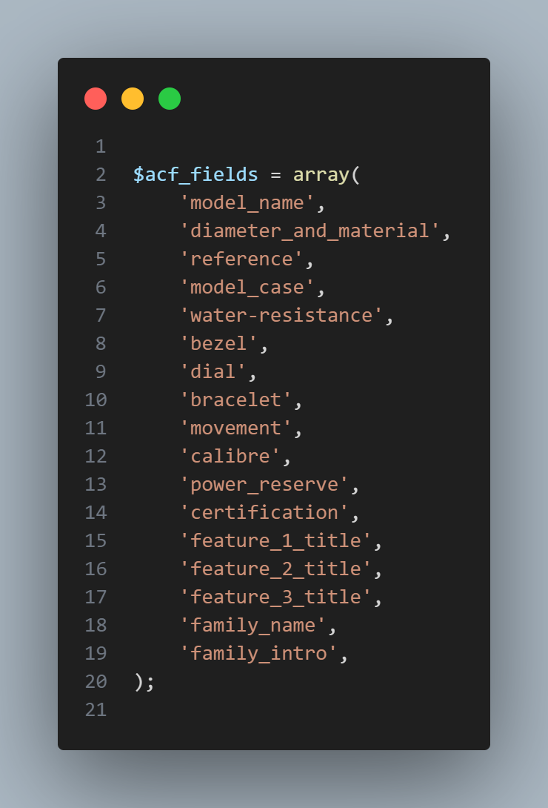

# WebHero Custom Search

A WordPress code snippet that implements an enhanced custom search functionality with advanced features and a modern user interface. This code can be integrated into your theme's `functions.php` or used as a standalone functionality file.

## Features

- Custom search form with real-time AJAX search functionality
- Combined search for both WooCommerce products, WordPress posts, and ACF fields
- Smart rate limiting based on client IP address
- Pagination support for both products and posts results
- Clean and responsive search interface
- Search query length validation (max 30 characters)
- Customizable search results display
- SEO-friendly URL structure for search pages

## Usage

1. Add the code to your theme's `functions.php` file or include it as a separate file
2. Configure the ACF fields to search through by modifying the `$acf_fields` array in the `get_product_results()` function as shown below:

3. Use the shortcode `[custom_search]` to display the search form
4. Use the shortcode `[custom_search_results]` to display search results

## Technical Details

- Implements IP-based rate limiting for search requests
- Removes default WooCommerce price and "Add to Cart" buttons from search results
- Includes custom styling and JavaScript for enhanced user experience
- Uses WordPress rewrite rules for clean search URLs
- Sanitizes and validates all user inputs
- Compatible with various proxy and load balancer setups

## Requirements

- WordPress installation
- WooCommerce plugin (for product search functionality)
- Advanced Custom Fields (ACF) plugin with the specified fields set up